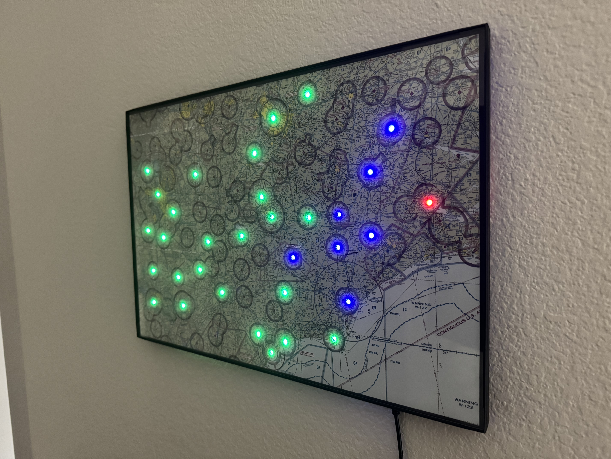

# Metar Map




Metar Map is a Python-based weather LED display for aviation enthusiasts, pilots, and makers. It fetches METAR data for selected airports and visualizes flight categories, lightning, and snow conditions using addressable LEDs (e.g., NeoPixel).

# Metar Map

Metar Map is a Python-based weather LED display for aviation enthusiasts, pilots, and makers. It fetches METAR data for selected airports and visualizes flight categories, lightning, and snow conditions using addressable LEDs (e.g., NeoPixel).

## Features
- Fetches live METAR data for configurable ICAO codes
- Visualizes flight category, lightning, and snow with customizable LED patterns
- Runs on Raspberry Pi or Linux devices
- Easy configuration via YAML file
- Robust auto-restart and single-instance support via systemd

## Quick Start


### 1. Download and Install

**Recommended:** Use the latest [tagged release](https://github.com/khurd21/Metar-Map/releases) for stability and compatibility.

```sh
# Download the latest release from GitHub Releases:
curl -L -o metar-map-latest.tar.gz $(curl -s https://api.github.com/repos/khurd21/Metar-Map/releases/latest | grep "browser_download_url.*tar.gz" | cut -d '"' -f4)
tar -xzf metar-map-latest.tar.gz
cd Metar-Map
poetry config virtualenvs.in-project true --local
poetry install
```

Or, to use a specific version:
```sh
git clone https://github.com/khurd21/Metar-Map.git
cd Metar-Map
git checkout <latest-tag>
poetry config virtualenvs.in-project true --local
poetry install
```

### 2. Configure
Edit `src/metar_map/static/config.yaml` to set your ICAO codes, LED patterns, refresh time, and brightness. See [Configuration](#configuration) for more details on setting up the config file.

### 3. Run
```sh
poetry run python -m metar_map
# Or, for debugging LED patterns:
poetry run python src/metar_map/led_controller.py
```

`NOTE:` You may need sudo permissions. If that is the case, you can run the script using the virtual environment like so:

```sh
sudo ./.venv/bin/python -m metar_map
```

### 4. (Optional) Enable as a Service
See `scripts/metar-map.service` for a sample systemd service file. This will auto-restart the program and run it on boot.

## Configuration

Edit `src/metar_map/static/config.yaml`:
- `icao_codes`: List of ICAO codes (use `-` for unused LEDs)
- `refresh_time`: How often to fetch new data (seconds)
- `brightness`: LED brightness (0.0–1.0)
- `led_patterns`: Customize colors, blink, and durations for each flight category

## LED Flight Category & Condition Mapping

By default, Metar Map uses the following LED colors and blink behaviors to represent flight categories and special weather conditions:

| Condition   | Color       | Blinks? | Description                                      |
|-------------|-------------|---------|--------------------------------------------------|
| VFR         | Green       | No      | Visual Flight Rules: Ceiling > 3,000 ft, Vis > 5 mi |
| MVFR        | Blue        | No      | Marginal VFR: Ceiling 1,000–3,000 ft or Vis 3–5 mi |
| IFR         | Red         | No      | Instrument Flight Rules: Ceiling 500–1,000 ft or Vis 1–3 mi |
| LIFR        | Pink        | No      | Low IFR: Ceiling < 500 ft or Vis < 1 mi          |
| Lightning   | White       | Yes     | Blinks white to indicate lightning detected      |
| Snow        | Bright Blue | Yes     | Blinks bright blue for snow or frozen precipitation |
| Gusts       | Yellow      | Yes     | Blinks yellow for strong wind gusts              |
| UNKNOWN     | Red         | Yes     | Blinks red if station data is missing or unknown |

These are the **default settings** as defined in your [config.yaml](./src/metar_map/static/config.yaml) file, but you can fully customize the color, blink speed, and duration for each condition by editing the `led_patterns` section in your configuration.

## Releases & Artifacts

Download pre-built packages from the [Releases page](https://github.com/khurd21/Metar-Map/releases) for easy setup.

## Development & Testing

Run tests and check formatting:
```sh
poetry run pytest
poetry run black --check .
```

## Hardware
- Designed for NeoPixel (WS2812) LEDs
- Uses `neopixel` and `board` Python libraries
- Works best on Raspberry Pi

## License
MIT
